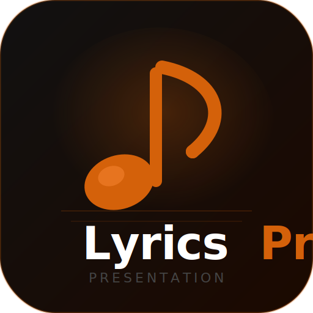

<div align="center">



# LyricsPro

**Software de apresentação de letras de músicas e Bíblia para igrejas**

[](https://dotnet.microsoft.com)
[](https://avaloniaui.net)
[](LICENSE)
[]()

</div>

---

## Visão Geral

O **LyricsPro** é um software de apresentação projetado para igrejas e eventos. Permite exibir letras de músicas, versículos da Bíblia, imagens e vídeos em um projetor ou segunda tela, com controle remoto pelo celular via Wi-Fi.

### Capturas de tela

| Tela inicial | Biblioteca de Letras | Projetor |
|:---:|:---:|:---:|
| *(Home)* | *(Letras Salvas)* | *(Fullscreen)* |

---

## Funcionalidades

### 🎵 Letras de Músicas
- **Busca na internet** via [lyrics.ovh](https://lyrics.ovh) e [lrclib.net](https://lrclib.net) — suporta PT, EN, ES e mais
- Importar letra com um clique para a biblioteca local
- Editar título, artista e letra
- Definir **imagem de fundo** por letra

### 📖 Bíblia
- Download automático de múltiplas versões:
  - **Português:** ACF, NVI, AA, NTLH, ARC, NVT
  - **English:** KJV, ESV, NIV, NKJV, NLT, WEB
  - **Español:** RVR, RVC
- Navegação por livro e capítulo
- Botão **Apresentar** envia diretamente para o projetor

### 🎬 Biblioteca de Mídia
- **Áudios (MP3):** reprodução em background enquanto apresenta slides
- **Vídeos:** reprodução no projetor (janela fullscreen na segunda tela)
- **Imagens:** apresentação como slide fullscreen no projetor
- Renomear e remover arquivos da biblioteca

### 📽️ Projetor
- Janela **fullscreen** abre automaticamente na segunda tela
- Navegação com teclado: `←` `→` slides, `B` tela preta, `ESC` fechar
- Ajuste de tamanho de fonte com `+` / `-`
- Tela preta instantânea
- Retomar apresentação após fechar a janela

### 📱 Controle Remoto pelo Celular
Quando uma apresentação está ativa, o app inicia automaticamente um servidor local:
- Acesse pelo celular (mesmo Wi-Fi): `http://IP:7890`
- **3 QR Codes** disponíveis: Controle geral · Letras · Bíblia
- Controles disponíveis no celular:
  - ← Slide anterior / Próximo →
  - Tela Preta
  - Play/Pause/Parar áudio
  - Play/Parar vídeo
  - Selecionar e apresentar letras direto do celular
  - Navegar na Bíblia e apresentar capítulos

---

## Tecnologias

| Camada | Tecnologia |
|---|---|
| UI Framework | [Avalonia UI 11](https://avaloniaui.net) — cross-platform (Windows + Linux) |
| Linguagem | C# 12 / .NET 8 |
| Banco de dados | SQLite via [Dapper](https://github.com/DapperLib/Dapper) |
| MVVM | [CommunityToolkit.Mvvm](https://learn.microsoft.com/en-us/dotnet/communitytoolkit/mvvm/) |
| Áudio/Vídeo | [LibVLCSharp](https://github.com/videolan/libvlcsharp) |
| Busca de letras | [lyrics.ovh](https://lyrics.ovh) + [lrclib.net](https://lrclib.net) |
| Bíblia | [bolls.life API](https://bolls.life) + CDN jsdelivr |
| QR Code | [QRCoder](https://github.com/codebude/QRCoder) |
| HTML scraping | [HtmlAgilityPack](https://html-agility-pack.net) |
| Servidor remoto | TCP/HTTP nativo (sem dependências extras) |

---

## Pré-requisitos

- Windows 10/11 (64-bit) ou Linux
- [.NET 8 SDK](https://dotnet.microsoft.com/download/dotnet/8.0)

---

## Como Rodar (Desenvolvimento)

```bash
# Clonar o repositório
git clone https://github.com/Mateuskjk/LyrcsPRO.git
cd LyrcsPRO

# Rodar o app
cd src/LyricsPro
dotnet run
```

---

## Gerar o Instalador (Windows)

### Pré-requisitos
- [Inno Setup 6](https://jrsoftware.org/isdl.php) instalado

### Processo completo (1 comando)

```powershell
# Na raiz do projeto
.\build-installer.ps1
```

O script executa automaticamente:
1. Gera `logo.png` e `logo.ico` a partir do SVG
2. Publica o app como **self-contained** (sem precisar instalar .NET na máquina alvo)
3. Empacota tudo com o Inno Setup

O instalador final é gerado em:
```
installer/output/LyricsPro-Setup-v1.0.0.exe  (~76 MB)
```

> O instalador inclui o .NET 8 Runtime, LibVLC e todas as dependências. Basta executar em qualquer Windows 10/11.

---

## Estrutura do Projeto

```
LyricsPro/
├── src/LyricsPro/
│   ├── Assets/             # Logo, ícones
│   ├── Converters/         # Value converters (XAML)
│   ├── Models/             # Entidades de dados
│   ├── Services/           # Lógica de negócio
│   │   ├── DatabaseService.cs
│   │   ├── LyricsSearchService.cs
│   │   ├── BibleDownloadService.cs
│   │   ├── MediaPlayerService.cs
│   │   ├── RemoteControlService.cs
│   │   └── SlideEngine.cs
│   ├── Styles/             # AppTheme.axaml (cores, estilos)
│   ├── ViewModels/         # MVVM ViewModels
│   └── Views/              # AXAML + code-behind
│       ├── MainWindow
│       ├── LyricsView
│       ├── SearchView
│       ├── BibleView
│       ├── MediaView
│       ├── ProjectorWindow
│       ├── VideoProjectorWindow
│       └── PresenterControlView
├── tools/
│   └── GenerateIcon/       # Ferramenta para gerar logo.ico
├── installer/
│   └── LyricsPro.iss       # Script Inno Setup
├── build-installer.ps1     # Script de build completo
└── LyricsPro.sln
```

---

## Paleta de Cores

| Cor | Hex | Uso |
|---|---|---|
| Fundo principal | `#111111` | Background da janela |
| Fundo sidebar | `#0A0A0A` | Barra lateral |
| Fundo card | `#1A1A1A` | Cards e listas |
| Laranja acento | `#D4610A` | Botões primários, destaques |
| Laranja claro | `#E87820` | Hover, ativo |
| Texto primário | `#F0F0F0` | Texto principal |
| Texto secundário | `#888888` | Subtítulos |

---

## Licença

Este projeto está sob a licença MIT. Veja o arquivo [LICENSE](LICENSE) para mais detalhes.

---

<div align="center">

Feito com ♪ para igrejas e ministérios

</div>
